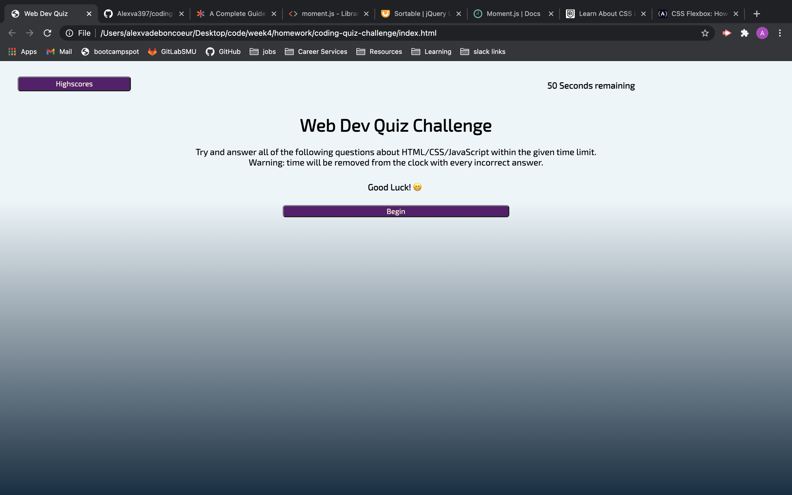
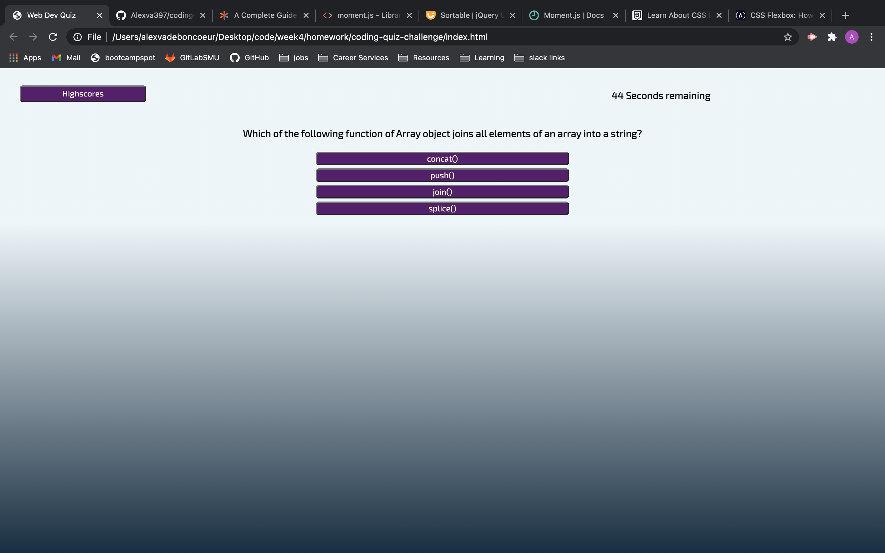
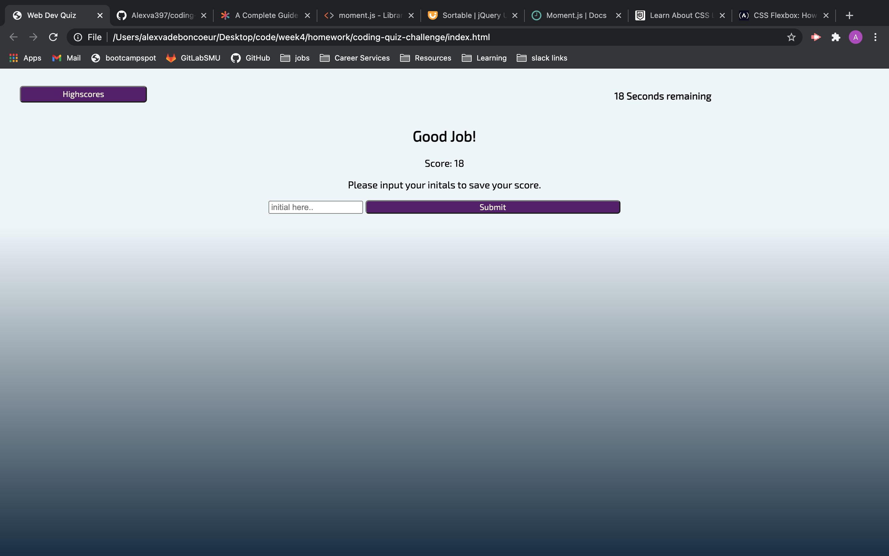
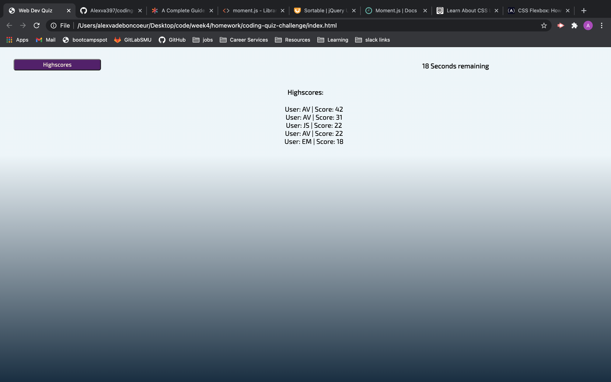

# coding-quiz-challenge

[Take The Quiz Here!]()

This quiz is designed to challenge you in the basics of Web Development!

When the user clicks the Start button they are taken to the first randomly generated question.
- *the user must answer the question correctly to move on to the next question.*
- *If the question is answered incorrectly, a wrong prompt apperars*
- *If the quesiton is answered incorrectly, 10 seconds are removed from the timer.*
- *If all the questions aren't answered withing the time limit. the user is prompted with a try again button that reloads the page*

Once every question answered, the time left is logged as the user score.

After the user inputs their Initials and clicks submit, their info is saved to local storage and then displayed on the highscores screen.

Score will be saved and generated to the highscore screen even if the browser is reloaded.

### Issues and Bugs

My original script.js file was giving an error for correctAnswer when I went to compare it to the user choice. After hours of trying to fix. I copied and pasted my declared variables and then rewrote each line of code following in a new file. The program ran fine after this. THe next big hurdle was getting the score to be stored in the object for local storage correctly. Eventually I discovered (with the help of a fellow student) that I did not need .value at the end of the score variable to read it, since the variable was a number instead of a string.

### Screenshots

